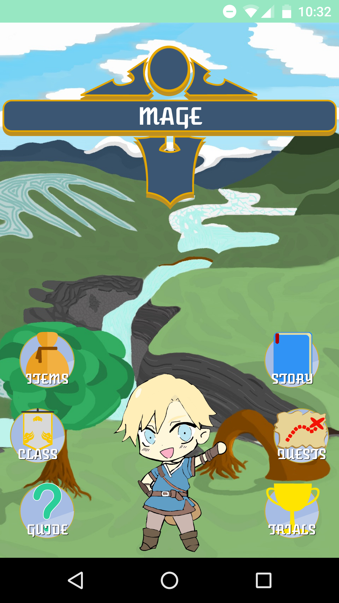

# Tibbi

Tibbi is a simple simultaneous fighting game. 
The goal of this project was to incorporate everything that I have learned from the Android Nanodegree by Udacity so far.
This is part of the Android Nanodegree by Udacity and it was my Capstone Project. 
The project is not final, the files in this repository are the bare bones of the game. 

  

The Image above is part of the game in development and it's not part of this repository, or the final game.
